# GNNGP: Graph Neural Network as Gaussian Process
This repository contains pytorch open source implementation of our ICLR2023 paper:

[Graph Neural Network-Inspired Kernels for Gaussian Processes in Semi-Supervised Learning](https://openreview.net/pdf?id=flap0Bo6TK_)

The code performs Gaussian Process (GP) inference by using kernels derived from the infinite-width limit of the graph neural networks (GNNs). The inference is scalable to large graph datasets through recursive Nystrom approximation of each layer.

# Examples

The `notebooks/` directory contains interactive notebooks to demo the usage and features of GNNGP.

# Usage

The `src/main.py` runs automatic experiments with following command line arguments:

## Model options
    --data      str     Possible values: Cora, CiteSeer, PubMed, chameleon, crocodile, squirrel, arxiv, Reddit.
    --method    str     Possible values: GCN, GCN2, GIN, SAGE.
    --action    str     Possible values: gnn, gp, rbf.
    --device    int     Default is `0` (GPU index 0). To run CPU tests, set this to `-1`.
    --runs      int     Default is `10` for random results and `1` for deterministic results.
    --verbose   bool    Default is `False`.

## Feature preprocessing
    --center    bool    Default is `False`.
    --scale     bool    Default is `False`.

## GP arguments
    --num_layers    int     Default is `2`.
    --sigma_b       float   Default is `0.0`.
    --sigma_w       float   Default is `1.0`.
    --fraction      int     Default is `0` (no Nystrom approximation).
Note: When `fraction<=0`, no Nystrom approximation. When `fraction>0`, each training point has a `1/fraction` probability to be chosen as landmark points.

## GNN arguments
    --num_layers    int     Default is `2`.
    --dim_hidden    int     Default is `256`.
    --dropout       float   Default is `0.5`.
    --lr            float   Default is `0.01`.
    --epochs        int     Default is `100`.
    --batch_size    int     Default is `0` (no mini-batching).

# Reproducing results
To reproduce results reported by the paper, use following shell scripts:

## Table 4: Performance of GCNGP, in comparison with GCN and GP with typical kernels
    sh table4.sh
The time result is also used in Figure 1 and Figure 2.

## Table 5: Performance comparison between GNNs and the corresponding GNNGPs
    sh table5.sh

## Figure 3: Performance of GNNs and GNNGPs as depth L increases
    sh figure3.sh

## Figure 4: Performance of GCNGP-X as number of landmark nodes increases
    sh figure4.sh

# Requirements
The code is implemented in

    Python 3.10.4 as distributed with Ubuntu 22.04 LTS
    Pytorch 1.11.0
    PyTorch Geometric 2.1.0
    CUDA 11.3

# Citation
    @inproceedings{niu2023graph,
        title={Graph Neural Network-Inspired Kernels for {Gaussian} Processes in Semi-Supervised Learning},
        author={Zehao Niu and Mihai Anitescu and Jie Chen},
        booktitle={International Conference on Learning Representations},
        year={2023},
        url={https://openreview.net/forum?id=flap0Bo6TK_}
    }

# License
Apache License Version 2.0 (APLv2).
