# GNNGP: Graphical Neural Network as Gaussian Process
This repository contains pytorch open source implementation of our ICLR2023 paper:

[Graph Neural Network-Inspired Kernels for Gaussian Processes in Semi-Supervised Learning](https://openreview.net/pdf?id=flap0Bo6TK_)

# Examples

To get started, the `notebooks/` contains interactive notebooks to playing with. They demo the major features of GNNGP and shows how it can be used in research.

# Usage

The `src/main.py` runs automatic experiments with following command line arguments:

## Model options
    --data      str     Possible values: Cora, CiteSeer, PubMed, chameleon, crocodile, squirrel, arxiv, Reddit.
    --method    str     Possible values: GCN, GCN2, GIN, SAGE.
    --action    str     Possible values: gnn, gp, rbf.
    --device    int     Default is `0` (GPU index 0). To run CPU tests, set this to `-1`.
    --runs      int     Default is `10` for random results and `1` for deterministic results.
    --verbose   bool    Default is `False`.

##  Preprocessing
    --center    bool    Default is `False`.
    --scale     bool    Default is `False`.

## GP arguments
    --num_layers    int     Default is `2`.
    --sigma_b       float   Default is `0.0`.
    --sigma_w       float   Default is `1.0`.
    --fraction      int     Default is `0` (no Nystrom approximation).

## GNN arguments
    --num_layers    int     Default is `2`.
    --dim_hidden    int     Default is `256`.
    --dropout       float   Default is `0.5`.
    --lr            float   Default is `0.01`.
    --epochs        int     Default is `100`.
    --batch_size    int     Default is `0` (no mini-batching).

# Reproduce results
To reproduce published results, use following shell scripts:

## Table 4: Performance of GCNGP, in comparison with GCN and typical GP kernels
    sh table4.sh
The time result is also used in Figure 1 and Figure 2.

## Table 5: Performance comparison between GNNs and the corresponding GP kernels
    sh table5.sh

## Figure 3: Performance of GNNs and GNNGPs as depth L increases
    sh figure3.sh

## Figure 4: Performance of GCNGP-X as number of landmark nodes increases
    sh figure4.sh

# Requirements
The code is implemented in

    Python 3.10.4 as distributed with Ubuntu 22.04 LTS
    Pytorch 1.11.0
    PyTorch Geometric 2.1.0
    CUDA 11.3

# License
Apache License Version 2.0 (APLv2).